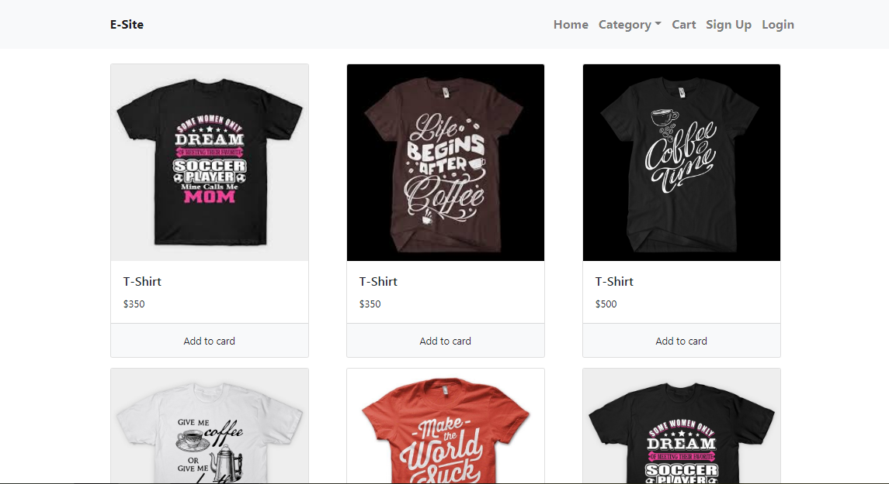

## Ecommerce website (Platform django, database-sqlite3)
> Features-<ul><li>Users can create their account(Sign Up,Login)</li>
            <li>Add to cart where you can add product or later can minus that product from your cart, products will be counted and shown in your navbar</li>
            <li>Check out</li>
            <li>From order module,you  can see previous all products info added in cart</li></ul>
       
#### There is one App called 'store', all the logics are  build in store/views.py file  and mapping them by the store/urls.py file
#### 'Ecommercesite' is the main project where you can find the settings.py, we have to link our app 'store' in settings.py file.
#### For run the project use command ' python manage.py runserver '
#### 'requirements.txt' file has all the required module that we need to install for run this project 

>Screenshot of the website 

> Here is the video  link  of this Ecommerce website that I uploaded in youtube - https://www.youtube.com/watch?v=iB3g9t6XsxQ&t=1s

>For know more about Django follow their documentation - https://docs.djangoproject.com/en/3.0/

